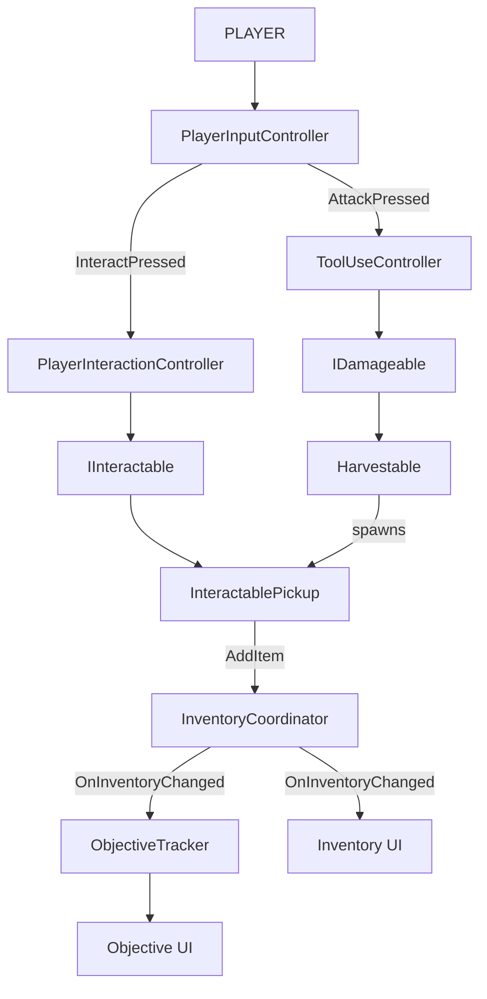

<div align="center">


[](https://unity.com) [](https://learn.microsoft.com/en-us/dotnet/csharp/) [](https://amoh2000.itch.io/isle-of-deceit) 


</div>

## 📖 About

Isle of Deceit is a solo survival horror game set on a deserted island. The project focuses on building modular gameplay systems that can support new mechanics and content without tightly coupling unrelated systems.

The current build is a small but complete vertical slice featuring inventory, equipment, tool-based harvesting, resource collection, and objective tracking.

## 🎮 Current gameplay loop

> **Find an axe → equip it from the inventory → chop trees → pick up the wood → complete the "collect 5 wood" objective.**

| Feature | Details |
|---|---|
| 👁️ **Interaction system** | Raycast-based "press E" interaction with an on-screen prompt |
| 🎒 **Tabbed inventory** | Tools, Resources, and Story items, with item details and context-sensitive actions (Equip / Unequip) |
| 🪓 **Equipment & tool use** | Equip and unequip tools; swings use each tool's own range, damage, and cooldown |
| 🌲 **Harvestable world objects** | Trees take damage and drop pickup items when depleted |
| 🎯 **Objective system** | Data-driven objective with a live HUD counter and a completion message |
| 🌐 **WebGL build** | Playable in the browser, no install |

## 🧱 Architecture

Systems are separated by clear dependency boundaries, with communication flowing primarily in one direction to avoid tightly coupled two-way dependencies.


### Architecture Principles
- **Single ownership:** `InventoryCoordinator` owns inventory state, while `EquipmentSystem` owns equipped-tool state.
- **Input isolation:** `PlayerInputController` translates Unity Input System callbacks into gameplay events.
- **One-way communication:** Systems depend on clear interfaces and events rather than tightly coupled two-way relationships.
- **Data-driven content:** `ItemData` and `ToolData` ScriptableObjects separate item configuration from gameplay systems.

## 🔍 Technical highlights

- **Tools hit anything through one small interface**

`ToolUseController` knows nothing about what it is being used on. It raycasts a distance taken from the equipped tool's `ToolData`, finds an `IDamageable`, and applies that tool's damage. This design means that adding enemies or other damageable entities in the future will not require changes to the `ToolUseController`.

```csharp
private void TryHitTarget(ToolData tool)
{
    Ray ray = new Ray(playerCamera.transform.position, playerCamera.transform.forward);
    if (!Physics.Raycast(ray, out RaycastHit hit, tool.Range)) { return; }

    IDamageable target = hit.collider.GetComponentInParent<IDamageable>();
    if (target == null) { return; }

    target.TakeDamage(tool.Damage);
}
```

- **Equipment state is owned by the equipment system**

Unequipping an equipped tool depends on `EquipmentSystem`'s private state, so that rule lives inside `EquipmentSystem`. The inventory follows the *Tell, Don't Ask* principle: it states what it wants (toggle this tool) and never inspects what is equipped to make the decision itself. If equipment storage changes later, only this class changes.

```csharp
// InventoryCoordinator: tells, doesn't ask
return equipmentSystem.TryToggleTool(itemData);

// EquipmentSystem: the only class that knows what "equipped" means
public bool TryToggleTool(ItemData itemData)
{
    if (equippedTool == itemData)
    {
        UnequipTool();
        return true;
    }

    return TryEquipTool(itemData);
}
```

- **Resources are added through configuration, not new code**

Harvestable is reusable across trees, rocks, and bushes. Each instance is configured with its health and drop prefab in the Inspector, while drops use the existing pickup and inventory systems.

```csharp
public class Harvestable : MonoBehaviour, IDamageable
{
    [SerializeField] private float maxHealth = 30f;
    [SerializeField] private GameObject dropPrefab;

    private float currentHealth;

    private void Awake()
    {
        currentHealth = maxHealth;
    }

    public void TakeDamage(float amount)
    {
        currentHealth -= amount;

        if (currentHealth <= 0f)
        {
            Deplete();
        }
    }

    private void Deplete()
    {
        Instantiate(dropPrefab, transform.position, Quaternion.identity);
        Destroy(gameObject);
    }
}
```

## 🚀 Getting started

**Play instantly:** [open the WebGL build](https://amoh2000.itch.io/isle-of-deceit)

**Run from source**

```bash
git clone https://github.com/amohamma18/IsleOfDeceit.git
```
1. Open **Unity Hub** → **Add project from disk** → select the cloned folder
2. Open Unity 6000.5.0f1 when prompted
3. Open the main scene in `Assets/Scenes/MainIsland.unity`
4. Press Play ▶️

## ⌨️ Controls

| Action | Input |
|---|---|
| Move | `W` `A` `S` `D` |
| Look | Mouse |
| Jump | `Space` |
| Interact / Pick up | `E` |
| Attack / Use equipped tool | `Left Click` |
| Open / Close inventory | `Tab` |

## 🗺️ Roadmap

| Status | Milestone |
|:--:|---|
| ✅ | Player movement, camera, and gravity |
| ✅ | Event-driven input and interaction system |
| ✅ | Inventory with resource, tool, and story-item storage |
| ✅ | Tool equipment and context-aware inventory UI |
| ✅ | Tool-based harvesting and `IDamageable` system |
| ✅ | Objective tracking driven by inventory events |
| ✅ | WebGL build |
| 📋 | Save / load player and inventory state |
| 📋 | Campfires as save points and crafting/cooking stations |
| 📋 | Cooking and healing system |
| 📋 | Animal AI with peaceful, neutral, and aggressive behaviours |
| 📋 | Story items, hidden islanders, and dialogue |
| 💭 | Psychological horror sequences and islander encounters |
| 💭 | Expanded survival and exploration systems |

**Status:** ✅ Done | 📋 Planned | 💭 Future ideas
## 📂 Where to look in the code

| Responsibility | Files |
|---|---|
| Input | `PlayerInputController` |
| Player | `PlayerMovement`, `PlayerLook`, `PlayerContext`, `CursorController` |
| Interfaces | `IInteractable`, `IDamageable` |
| Interaction | `PlayerInteractionController`, `InteractablePickup` |
| Inventory | `InventoryCoordinator`, `InventoryController` |
| Equipment | `EquipmentSystem`, `ToolUseController`, `Harvestable` |
| World | `ObjectiveTracker` |
| UI | `InteractionPromptUI`, `InventoryUI`, `InventorySlotUI`, `ObjectiveUI` |
| Data | `ItemData`, `ToolData`, `ResourceStorage`, `ToolStorage`, `StoryItemStorage`, `InventorySlotData` |

## 📬 Contact

**Asifzaman Mohammad** | [LinkedIn](https://www.linkedin.com/in/asifzaman-mohammad-456714285) | [GitHub](https://github.com/amohamma18) | [amohamma2000@gmail.com](mailto:amohamma2000@gmail.com)
